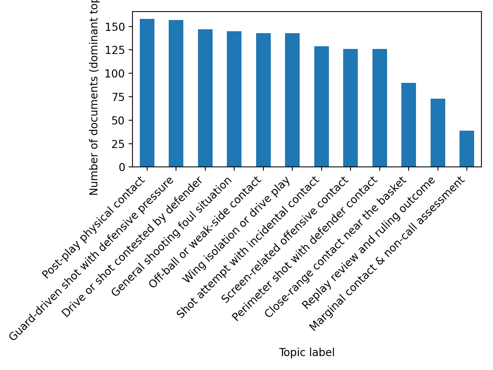
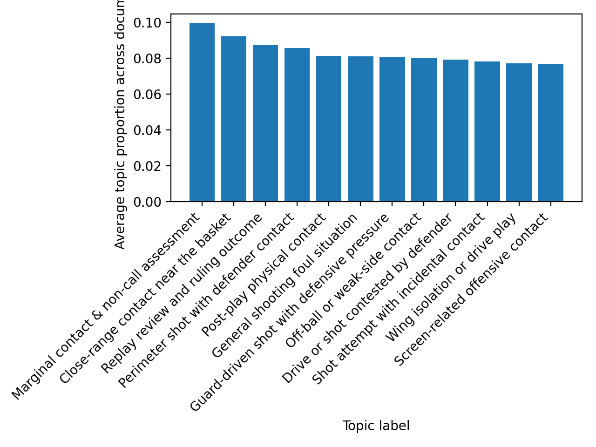

# NBA_Last_Two_Minute_Topic_Modeling_Mallet

Topic modeling of NBA Last Two Minute Reports (2015–2018) using MALLET (LDA)

---

## Data Source

Text data derived from:

https://github.com/the-pudding/last-two-minute-report

The original repository converts NBA Last Two Minute Report PDFs into structured CSV format.  
From this dataset, explanatory text fields (2015–2018 seasons) were extracted and compiled into a corpus of over 26,000 textual records.

---

## Method

### 1. Programming Environment

- Java (MALLET 2.1.0)
- Maven (dependency management & build)
- Python (data extraction, labeling, visualization)

MALLET was compiled locally using Maven. Topic modeling was performed via command-line execution.

---

### 2. Data Processing Pipeline

1. Extracted explanatory comments from CSV (`extract_comments.py`)
2. Cleaned and normalized text
3. Converted text files into MALLET format (`Text2Vectors`)
4. Trained LDA model with 12 topics (`Vectors2Topics`)
5. Generated topic distributions and keyword summaries
6. Assigned manual topic labels (`label_topics.py`)
7. Visualized topic distributions (`plot_topics.py`)

---

## Output

### Model Output Files

- `topic-keys.txt`  
  Top keywords for each topic.

- `doc-topics.txt`  
  Topic probability distribution per document.

- `labelled_doc_topics.csv`  
  Topic labels manually assigned for interpretability.

- `dominant_topics_per_doc.csv`  
  Most probable topic per document.

---

### Visualizations

Topic distribution across corpus:

Average topic share:

---

## Observations

The model identifies recurring patterns in officiating explanations, including:

- Contact and incidental calls
- Screen legality and positioning
- Replay and clock review decisions
- Marginal / enhanced calls

Topic coherence reflects the standardized language used in NBA officiating reports.

---

## Drawbacks

- Highly formulaic language reduces topic diversity.
- Some topics overlap due to repetitive phrasing.
- Manual labeling remains necessary for interpretability.
- Results depend on the predefined number of topics (K=12).

---

Feedback and suggestions are welcome.
